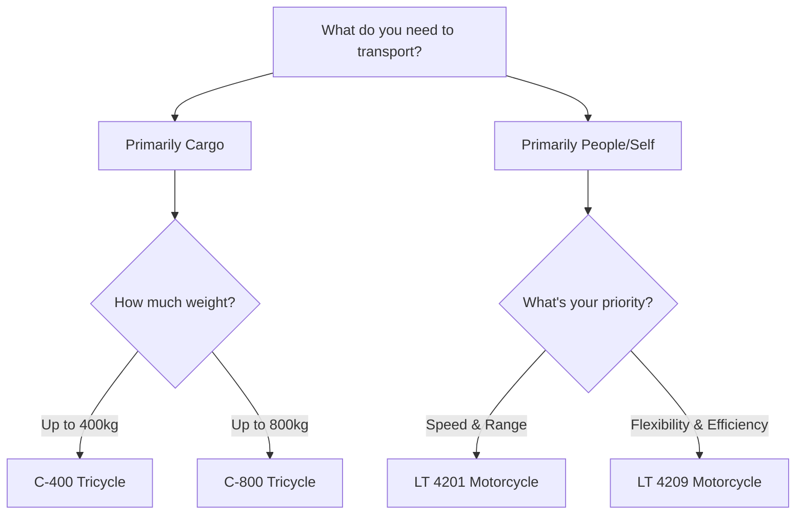

Electric mobility is transforming urban transportation. Whether you need a vehicle for cargo delivery, passenger transport, or personal commuting, Parts ITL Corp offers sustainable solutions tailored to your requirements.

## Understanding Your Mobility Needs

Before choosing an electric vehicle, assess your specific requirements to ensure you select the best solution.

<Steps>
  <Step title="Define Your Primary Use Case">
    Identify how you'll primarily use the vehicle:
    - **Cargo Transport**: Delivering goods or materials across the city
    - **Passenger Transport**: Moving people in urban or suburban areas
    - **Personal Commuting**: Daily travel to work or running errands
    - **Mixed Use**: Combination of cargo and passenger needs
  </Step>

  <Step title="Calculate Your Daily Requirements">
    Consider these key factors:
    - **Daily Distance**: How many kilometers will you travel per day?
    - **Load Capacity**: What weight do you need to transport regularly?
    - **Speed Requirements**: What maximum speed do you need for your routes?
    - **Terrain Type**: Will you navigate flat roads or hills?
  </Step>

  <Step title="Evaluate Your Charging Infrastructure">
    Assess your charging capabilities:
    - Do you have access to electrical outlets at your base location?
    - What is your typical vehicle downtime for charging?
    - Do you need multiple battery options for extended operation?
  </Step>
</Steps>

<Note>
All our electric vehicles use LifePO4 battery technology, known for safety, longevity, and consistent performance. Charging times typically range from 6-8 hours for a full charge.
</Note>

## Choosing Your Vehicle

Parts ITL Corp offers two main categories of electric vehicles, each designed for specific use cases.

### Electric Tricycles

Ideal for cargo transport and stability on varied road conditions.

<CardGroup cols={2}>
  <Card title="C-400 Tricycle" icon="truck" href="/specifications/c400-tricycle">
    **Best for**: Light to medium cargo delivery
    
    - Up to 70km range per charge
    - 400kg load capacity
    - LifePO4 60V - 90Ah battery
    - Three-wheel stability design
    - Open cargo area for easy loading
    
    **Ideal Applications**: Food delivery, e-commerce logistics, retail distribution
  </Card>

  <Card title="C-800 Tricycle" icon="box-truck" href="/specifications/c800-tricycle">
    **Best for**: Heavy cargo and passenger transport
    
    - Up to 70km range per charge
    - 800kg load capacity
    - LifePO4 60V - 90Ah battery
    - Weather-protected cabin
    - Suitable for cargo and passengers
    
    **Ideal Applications**: Construction materials, bulk deliveries, passenger shuttle services
  </Card>
</CardGroup>

<Info>
The C-800's enclosed cabin provides weather protection, making it suitable for year-round operation in all conditions. The extra load capacity makes it perfect for businesses with heavier transport needs.
</Info>

### Electric Motorcycles

Perfect for personal commuting and urban navigation with exceptional maneuverability.

<CardGroup cols={2}>
  <Card title="LT 4201 Motorcycle" icon="motorcycle" href="/specifications/lt4201-motorcycle">
    **Best for**: Fast urban commuting
    
    - Up to 80km range per charge
    - LifePO4 60V - 30Ah battery
    - Maximum speed: 45-50 km/h
    - Modern aerodynamic design
    - Exceptional maneuverability
    
    **Ideal Applications**: Daily commuting, courier services, rapid urban travel
  </Card>

  <Card title="LT 4209 Motorcycle" icon="bicycle" href="/specifications/lt4209-motorcycle">
    **Best for**: Flexible assisted mobility
    
    - 40-80km range (varies by model)
    - LifePO4 48V battery systems
    - Maximum speed: 30 km/h
    - Electric assist with pedal option
    - Smooth and silent operation
    
    **Ideal Applications**: Short commutes, eco-friendly errands, mixed electric/manual travel
  </Card>
</CardGroup>

## Quick Selection Guide

Use this decision tree to quickly identify your best vehicle option:

## Getting Your Quote

Once you've identified your ideal vehicle, follow these steps to request a personalized quote:

<Steps>
  <Step title="Gather Your Requirements">
    Prepare this information before contacting us:
    - Selected vehicle model(s)
    - Quantity needed
    - Your intended use case
    - Expected daily distance
    - Any special requirements (color preferences, modifications, etc.)
  </Step>

  <Step title="Contact Our Team">
    Reach out through your preferred channel:
    
    **WhatsApp** (Fastest Response)  
    +507 6430-0025  
    [Send WhatsApp Message](http://wa.me/50764300025?text=Hola,%20he%20visitado%20su%20web,%20me%20interesa%20el%20servicio%20que%20ofrece%20y%20quisiera%20más%20información)
    
    **Email**  
    part.itl.comercial@gmail.com
    
    **Phone**  
    +507 6430-0025
    
    **Visit Us**  
    Ave Samuel Lewis, SL55 Tower, No Orden ITL 1620, Panama
  </Step>

  <Step title="Receive Expert Consultation">
    Our team will:
    - Review your requirements in detail
    - Recommend the best vehicle configuration
    - Provide detailed pricing and financing options
    - Answer all technical questions
    - Explain maintenance and support services
  </Step>

  <Step title="Complete Your Purchase">
    After consultation:
    - Review and approve the quote
    - Arrange payment and delivery
    - Schedule vehicle orientation
    - Receive documentation and warranty information
  </Step>
</Steps>

<Note>
Our expert team provides personalized consultation to ensure you select the perfect vehicle for your specific needs. Don't hesitate to ask questions—we're here to help you make the best decision.
</Note>

## Spare Parts Availability

Parts ITL Corp maintains a comprehensive inventory of genuine spare parts for all our vehicles.

### Available Spare Parts

<CardGroup cols={3}>
  <Card title="Tires & Tubes" icon="circle">
    - R12 X 450 tires
    - R12 X 450 tubes
    - 3.5-12 C-400 tires
    - 3.5-12 C-400 tubes
  </Card>

  <Card title="Battery Systems" icon="battery-full">
    - Replacement LifePO4 batteries
    - Battery management systems
    - Charging equipment
    - Battery accessories
  </Card>

  <Card title="Electronic Components" icon="microchip">
    - Controllers
    - Displays
    - Wiring harnesses
    - Sensors and switches
  </Card>
</CardGroup>

<Info>
All spare parts are genuine OEM components designed for optimal fit and performance. Contact us for availability and pricing on specific parts.
</Info>

## Why Choose Parts ITL Corp

<CardGroup cols={2}>
  <Card title="Guaranteed Quality" icon="shield-check">
    All vehicles and parts come with certification, ensuring your investment is protected and safe. We stand behind every product we sell.
  </Card>

  <Card title="Complete Inventory" icon="warehouse">
    Extensive range of parts—from tires to electronic components—ready for immediate shipment. Minimize downtime with our fast availability.
  </Card>

  <Card title="Expert Advisory" icon="user-headset">
    Our team helps you choose the exact vehicle or part for your specific needs. Benefit from years of experience in electric mobility.
  </Card>

  <Card title="Competitive Pricing" icon="dollar-sign">
    Best price-to-quality ratio in the electric mobility market. Get professional-grade vehicles without premium prices.
  </Card>
</CardGroup>

## Next Steps

<CardGroup cols={3}>
  <Card title="Explore Products" icon="magnifying-glass" href="/products/electric-tricycles">
    Browse our complete catalog of electric tricycles, motorcycles, and spare parts
  </Card>

  <Card title="Technical Specs" icon="file-lines" href="/specifications/battery-systems">
    Review detailed specifications for all vehicles and battery systems
  </Card>

  <Card title="Contact Us" icon="envelope" href="/company/contact">
    Get in touch for a personalized quote and expert consultation
  </Card>
</CardGroup>

---

Ready to join the electric mobility revolution? [Request your quote today](/company/contact) and discover how Parts ITL Corp can transform your transportation needs.
